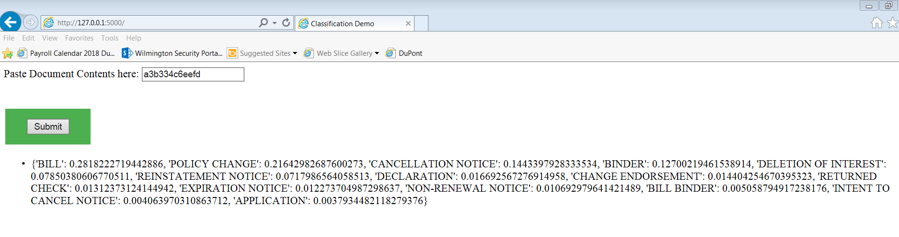

# PySpark-Doc-Classify
HeavyWater Coding Assignment 

### Document Classification  
##### Developed a machine learning model using PySpark. 
  Code included in classification.py 
  ##### Model Accuracy = 83%

##### Developed a RESTful service using Python's Flask framework 
  Code included in application.py 

### Running the Rest Service Locally

### Web Service
Deployed the Web Service on Heroku -  https://doc-classify-heavywater.herokuapp.com/  
[Facing problems with Spark while deploying on Heroku!]

### Execution Steps  
./classification.py  
./app.py  
run http://127.0.0.1:5000/ on your browser

